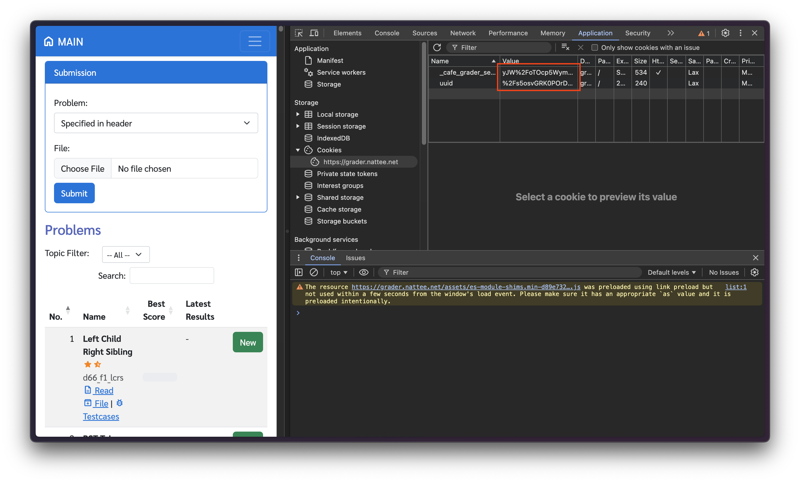

# grader-dumper
Dump all PDFs from Nattee's grader

## Setup and Run

1. **Clone or Download the Project**: Clone this repository or download the files to your local machine.

2. **Download HTML from the Grader Website**:
   - Log in to the grader website.
   - Download the HTML page and save it as `web.html`.
   - Place the file into this directory, replacing any existing `web.html`.

3. **Make the Setup Script Executable**:
   Open a terminal in the project directory and run the following command to grant execute permissions to the setup script:
   ```bash
   chmod +x setup.sh
   ```

4. **Run the Setup Script**:
   Execute the setup script to create a virtual environment, install dependencies, set up the `.env` file, and start the program:
   ```bash
   ./script.sh
   ```

5. **Enter Cookie Information**:
   - Copy the cookies from the grader website while logged in.
   - During setup, you’ll be prompted to provide the following information:
     - `_cafe_grader_session`: Your session cookie
     - `uuid`: Your unique user identifier

   

   Enter these values when prompted. The script will store them in the `.env` file.

6. **Output Location**:
   - All files will be downloaded to the `data%algo` folder after the script is executed.

## Notes

- The cookies provided to this program are only valid for a short period of time. If you want to use the program again later, run `script.sh` and enter new cookies.
- Ensure `web.html` is always the latest version downloaded from the grader site before running the script again.